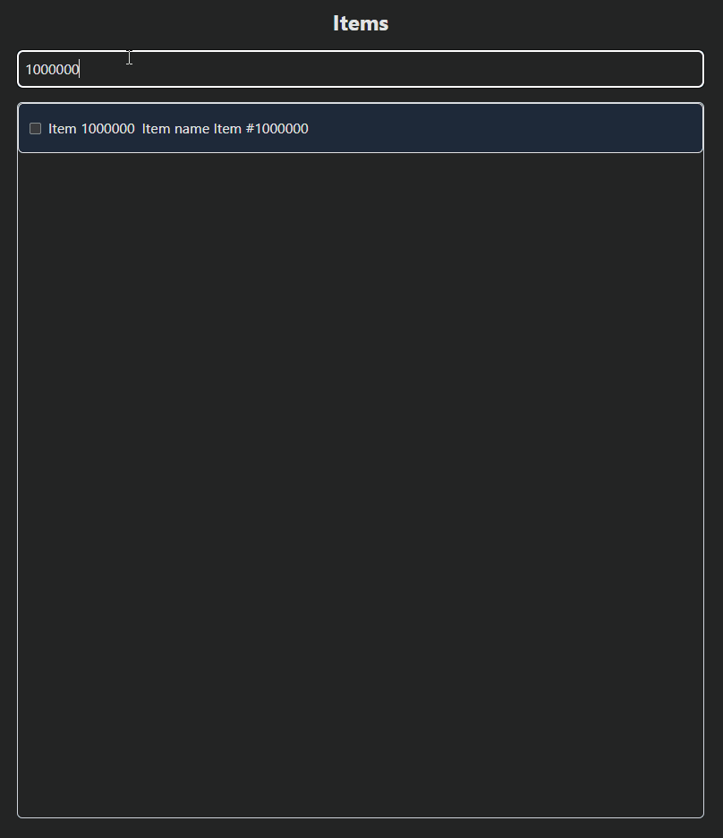

# 🧪 Виртуализация списка с Drag-and-Drop

Проект для тестирования виртуализации с помощью библиотеки [react-virtuoso](https://virtuoso.dev/) и её взаимодействия с drag-and-drop (через [dnd-kit](https://dndkit.com/)).

## ✨ Возможности

- Виртуализация большого списка (до 1 000 000 элементов)
- Drag-and-drop перестановка элементов
- Бесконечная прокрутка с подгрузкой элементов
- Минималистичный UI с Tailwind
- Удобная работа даже с огромными списками

## ⚙️ Стек технологий

**Клиент:** React, TypeScript, Axios, React Query, Tailwind  
**Сервер:** Node.js, Express

## 👨‍💻 Демонстрация работы



## 🚀 Как запустить

1. Клонируйте репозиторий:
  ```bash
  git clone https://github.com/your-name/your-repo.git
  cd your-repo
  ```
2. Установите зависимости:
  ```bash
  cd client
  npm install
  cd ../server
  npm install
  ```
3. Запустите сервер:
  ```bash
  cd server
  npm run dev
  ```
4. Запустите клиент:
  ```bash
  cd ../client
  npm run dev
  ```
